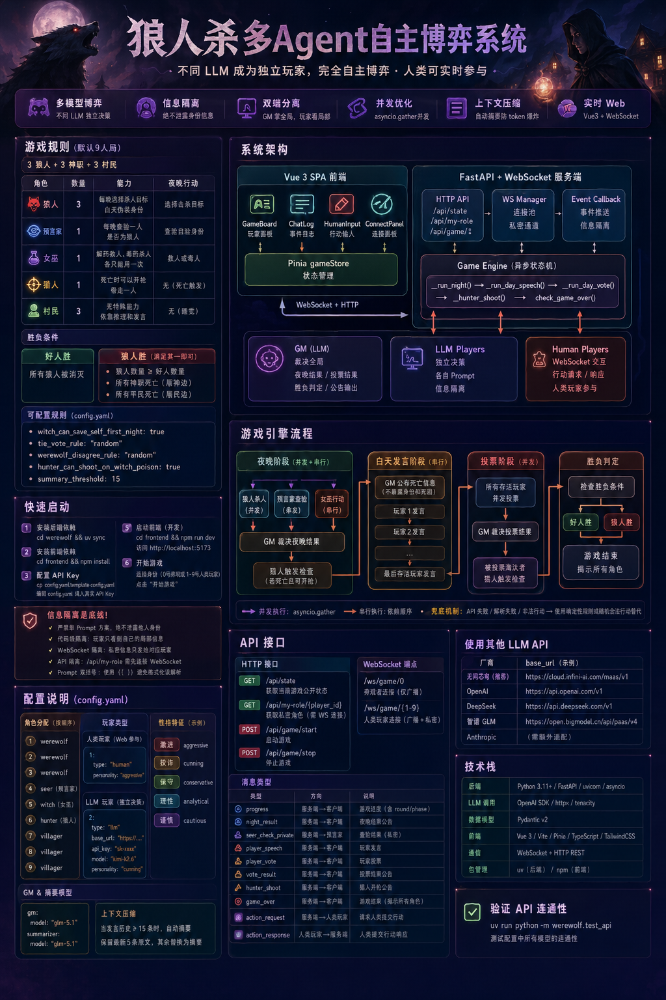

# Multi-Agent Werewolf Game System



A werewolf game where different LLM providers act as independent players, engaging in fully autonomous strategic gameplay. Human players can also participate through a real-time web frontend.

## Key Features

- **Multi-Model Gameplay**: Different LLMs (GLM, Kimi, DeepSeek, GPT, MiniMax, etc.) act as independent players, each making their own decisions
- **Human Participation**: Human players can join via a web frontend, competing against LLM agents in real-time
- **Information Isolation**: Each Agent only knows its own identity and public information — never other players' roles. This is the system's most critical design constraint
- **Dual Architecture**: GM (referee) and Player Agents use separate LLM calls — GM sees the full picture, players only see their own perspective
- **Concurrent Optimization**: Night actions and voting phases use `asyncio.gather` for parallel LLM requests, improving game efficiency
- **Context Compression**: When speech history grows too long, a summarizer model automatically compresses context to prevent token overflow
- **Real-time Web Frontend**: Vue 3 SPA + WebSocket for live game updates
- **Atmospheric UI**: Glass morphism panels, role-specific glow effects, phase-aware dynamic color themes, narrative-style event logs

## Project Structure

```
werewolf/
  config.yaml                # Game configuration (roles, models, rules)
  config.yaml.template       # Configuration template (no API keys — for new users)
  pyproject.toml             # uv project config + Python dependencies
  .gitignore                 # Git ignore rules (excludes config.yaml etc.)
  src/werewolf/
    __init__.py
    models.py                # Pydantic v2 data models + ActionProvider protocol
    llm_client.py            # Unified async LLM client (OpenAI SDK compatible)
    prompts.py               # GM/Player prompt construction logic
    config.py                # YAML config loader
    game_engine.py           # Core async state machine engine
    human_player.py          # Human player WebSocket interaction layer
    server.py                # FastAPI + WebSocket server
    test_api.py              # API connectivity test script
  frontend/
    package.json             # Frontend deps (Vue 3 + Pinia + TailwindCSS)
    vite.config.ts           # Vite config (API/WebSocket proxy)
    tailwind.config.js       # TailwindCSS config (role colors + custom animations)
    src/
      style.css              # Global styles (glass panels, role effects, phase animations)
      main.ts                # Entry point
      App.vue                # Main page (phase-aware dynamic themes, role info banner)
      types.ts               # TypeScript type definitions
      components/
        GameBoard.vue        # Player board (3×3 grid, role badges, death effects)
        ChatLog.vue          # Event log (narrative style, phase dividers, entry animations)
        HumanInput.vue       # Human action input (role-specific glow, glass panel)
        ConnectPanel.vue     # Connection panel
      stores/
        gameStore.ts         # Pinia state management + WebSocket communication
```

## System Architecture

```
┌─────────────────────────────────────────────────────────────┐
│                   Vue 3 SPA Frontend                        │
│                                                             │
│  ┌──────────┐  ┌──────────┐  ┌──────────┐  ┌──────────┐   │
│  │GameBoard │  │ ChatLog  │  │HumanInput│  │ConnectPnl│   │
│  │(Players) │  │(Events)  │  │(Actions) │  │(Connect) │   │
│  └──────────┘  └──────────┘  └──────────┘  └──────────┘   │
│         │            │            │                          │
│         └─── Pinia gameStore ────┘                          │
│                    │ WebSocket + HTTP                       │
└────────────────────┼────────────────────────────────────────┘
                     │
┌────────────────────┼────────────────────────────────────────┐
│          FastAPI + WebSocket Server                         │
│                    │                                        │
│  ┌─────────┐  ┌───┴───┐  ┌──────────┐                      │
│  │HTTP API │  │ WS Mgr│  │Event CB  │                      │
│  │/api/state│ │Pool   │  │Push     │                      │
│  │/api/my-role││Private│  │Isolation│                      │
│  └─────────┘  └───────┘  └──────────┘                      │
│                    │                                        │
│         ┌─────────┴──────────┐                              │
│         │   Game Engine      │                              │
│         │  (Async State Mch) │                              │
│         │                    │                              │
│         │  _run_night()      │                              │
│         │  _run_day_speech() │                              │
│         │  _run_day_vote()   │                              │
│         │  _hunter_shoot()   │                              │
│         └────────────────────┘                              │
│              │            │                                 │
│   ┌─────────┴──┐  ┌──────┴──────┐  ┌──────────────┐       │
│   │ GM (LLM)   │  │ LLM Players │  │Human Players │       │
│   │  Referee   │  │ Independent │  │  WebSocket   │       │
│   └────────────┘  └─────────────┘  └──────────────┘       │
└─────────────────────────────────────────────────────────────┘
```

### Information Isolation — Key Path

1. **Prompt Layer**: GM holds full game state but only outputs public announcements; Player Agent prompts contain only their own role, private memories, GM broadcasts, and their own private info
2. **WebSocket Layer**: Broadcast events don't contain role information; private action requests (e.g., seer check results, witch potion status) are sent only to the corresponding player
3. **API Layer**: `/api/my-role` requires an established WebSocket connection before querying
4. **Frontend Layer**: Role information is visible for spectator/development reference; human players only see their own role

### Game Engine Flow

```
Game Loop:
  ┌──→ _run_night() ──────────────────────────┐
  │     │                                     │
  │     │  Concurrent: Wolves choose + Seer   │
  │     │  Serial: Witch action (needs wolf   │
  │     │         target info)                │
  │     │  GM rules on night result           │
  │     │  Hunter death trigger → shoot()     │
  │     │                                     │
  │     _run_day_speech() ────────────────────│
  │     │                                     │
  │     │  Serial: Each surviving player      │
  │     │  speaks in turn (later speakers     │
  │     │  hear earlier speeches)             │
  │     │                                     │
  │     _run_day_vote() ──────────────────────│
  │     │                                     │
  │     │  Concurrent: All alive players vote │
  │     │  GM rules on vote result            │
  │     │  Eliminated → Hunter trigger → shoot│
  │     │                                     │
  │     check_game_over() ──→ Winner? ────────│
  │                                           │
  └─── No ←←←←←←←←←←←←←←←←←←←←←←←←←←←←←←←
      Yes → game_over
```

**Concurrency Strategy**:
- Wolves + Seer: `asyncio.gather` (independent actions)
- Witch: Serial after wolves (needs to know who was killed)
- Day speeches: Serial (later speakers can reference earlier ones)
- Voting: `asyncio.gather` (prevents later voters from knowing earlier votes)

**Fallback Mechanisms**:
- GM API failure → deterministic rule-based ruling (majority vote, random selection, etc.)
- Player action failure → random valid action as substitute
- JSON parse failure → automatic extraction from text response

## Quick Start

### Prerequisites

- Python 3.11+
- Node.js 18+
- [uv](https://docs.astral.sh/uv/) (Python package manager)

### 1. Install Backend Dependencies

```bash
cd werewolf
uv sync
```

### 2. Install Frontend Dependencies

```bash
cd frontend
npm install
```

### 3. Configure API Key

```bash
cp config.yaml.template config.yaml
```

Edit `config.yaml`, replacing all `<YOUR_API_KEY>` and `<YOUR_API_BASE_URL>` with your actual API configuration:

```yaml
game:
  gm:
    base_url: "https://cloud.infini-ai.com/maas/v1"
    api_key: "sk-xxxxxxxxxxxxx"
    model: "glm-5.1"
```

This project recommends using [InfiniAI](https://cloud.infini-ai.com)'s unified API interface, which is compatible with the OpenAI SDK format. Available models include: glm-5.1, kimi-k2.6, deepseek-v4-pro, gpt-5.4, minimax-m2.7, and more.

> **Note**: `config.yaml` contains sensitive API keys and is excluded by `.gitignore` — it will not be committed to Git. The template `config.yaml.template` contains no secrets and is meant as a reference for new users.

### 4. Start Backend Server

```bash
uv run python -m werewolf.server
```

Backend runs at `http://localhost:8000`.

### 5. Start Frontend (Dev Mode)

```bash
cd frontend
npm run dev
```

Frontend runs at `http://localhost:5173`, with automatic API and WebSocket proxy to the backend.

### 6. Start Playing

1. Open browser at `http://localhost:5173`
2. Choose identity: Spectator (Player 0) or Human Player (1–9)
3. Click "Connect"
4. Click "Start Game"

As a human player, you'll receive action requests at the bottom of the screen during gameplay (choose kill target, make speeches, vote, etc.). Only you can see your own role and private information.

## Game Rules

### Default Configuration (9-Player Game)

3 Werewolves + 3 Special Roles + 3 Villagers:

| Role | Count | Ability | Night Action |
|------|-------|---------|-------------|
| Werewolf | 3 | Choose a kill target each night, disguise identity during the day | Choose kill target |
| Seer | 1 | Check one player each night to determine if they are a werewolf | Check target identity |
| Witch | 1 | Has one save potion and one poison potion — cannot use both in the same night | Decide to save/poison |
| Hunter | 1 | Can shoot one player upon death (not if killed by poison, configurable) | Triggered on death |
| Villager | 3 | No special ability — relies on reasoning and speech | None (sleep) |

### Win Conditions

- **Good team wins**: All werewolves are eliminated
- **Werewolf team wins** (any one condition suffices):
  - Number of werewolves ≥ number of good players (majority)
  - All special roles (Seer, Witch, Hunter) are dead — "Slaughter God Side" (屠神边)
  - All villagers are dead — "Slaughter Villager Side" (屠民边)

The game-over announcement includes the specific reason ("all werewolves eliminated", "slaughter god side — all special roles dead", "slaughter villager side — all villagers dead", "werewolf majority").

### Night Phase Flow

```
Night falls
  ├─ Werewolves choose kill target (concurrent across multiple wolves)
  ├─ Seer checks target identity (concurrent with wolves)
  ├─ Witch decides save/poison (serial — needs to know who was killed)
  ├─ GM rules on night result (computes deaths, witch potion effects)
  └─ Hunter trigger check (if hunter died and can_shoot=True → shoot)
```

### Day Phase Flow

```
Day begins
  ├─ GM announces deaths from last night (no killer role revealed)
  ├─ Day speeches: surviving players speak in turn (serial)
  ├─ Voting: all surviving players vote concurrently
  ├─ GM rules on vote result
  ├─ Hunter trigger check (if eliminated player is hunter → shoot)
  └─ Check win conditions
```

### Configurable Rules

In `config.yaml` under `game.rules`:

| Setting | Default | Description |
|---------|---------|-------------|
| `witch_can_save_self_first_night` | `true` | Whether witch can save herself on the first night |
| `tie_vote_rule` | `"random"` | How to handle tied votes (random = eliminate randomly) |
| `werewolf_disagree_rule` | `"random"` | How to resolve when wolves disagree on target |
| `hunter_can_shoot_on_witch_poison` | `true` | Whether hunter can shoot when killed by witch's poison |
| `summary_threshold` | `15` | Number of speech entries that trigger context compression |

## Configuration Guide

### Role Assignment

Roles are assigned in order under `game.roles` — the count must match the number of `players` entries:

```yaml
game:
  roles:
    - werewolf   # Player 1
    - werewolf   # Player 2
    - werewolf   # Player 3
    - seer       # Player 4 — Seer
    - witch      # Player 5 — Witch
    - hunter     # Player 6 — Hunter
    - villager   # Player 7
    - villager   # Player 8
    - villager   # Player 9
```

### Player Types

Each player can be either an LLM or a human:

```yaml
players:
  1:
    type: "human"              # Human player — no API config needed
    personality: "aggressive"
  2:
    type: "llm"                # LLM player
    base_url: "https://cloud.infini-ai.com/maas/v1"
    api_key: "YOUR_API_KEY"
    model: "kimi-k2.6"
    personality: "cunning"
```

Human players interact through the web frontend. The system sends action requests via WebSocket and waits for human responses.

### Personality Traits

Each player is assigned a personality trait, causing different models to exhibit different play styles:

| Trait | Description |
|-------|-------------|
| aggressive | Proactive accusations, tends to take initiative |
| cunning | Strong disguise ability,擅长 misleading others |
| conservative | Careful speech, avoids risks |
| analytical | Logic-driven reasoning, cites evidence |
| cautious | Avoids taking sides, observes more |
| bold | Takes risks,大胆 guesses |
| eloquent | Lengthy and persuasive speeches |
| observant | Notices details, catches contradictions |
| strategic | Long-term planning, purposeful actions |

### GM and Summarizer Models

The GM handles game logic rulings (night results, vote results, win conditions). The summarizer compresses overly long speech histories:

```yaml
game:
  gm:
    model: "glm-5.1"            # Use a strong model for accurate rulings
  summarizer:
    model: "glm-5.1"            # Stable model to avoid rate limits
```

### Context Compression

When speech history exceeds `summary_threshold` entries, the engine automatically compresses context:

```python
# Original: 30 speech records
# Compressed: "Rounds 1-2: Wolves killed Player 4, witch saved Player 4..." (~200 char summary)
# Latest 5 speeches kept as full text, earlier ones replaced by summary
```

## API Reference

### HTTP Endpoints

| Endpoint | Method | Description |
|----------|--------|-------------|
| `/api/state` | GET | Get current public game state (players, phase, round) |
| `/api/my-role/{player_id}` | GET | Get human player's private role info (requires WebSocket first) |
| `/api/game/start` | POST | Start the game |
| `/api/game/stop` | POST | Stop the game |

### WebSocket Endpoints

| Endpoint | Description |
|----------|-------------|
| `/ws/game/0` | Spectator connection — receives broadcast events only |
| `/ws/game/{1-9}` | Human player connection — receives broadcast + private action requests |

### Message Types

| Type | Direction | Description |
|------|-----------|-------------|
| `progress` | Server→Client | Game progress notification (includes round/phase for state sync) |
| `night_result` | Server→Client | Night result announcement |
| `seer_check_private` | Server→Seer | Seer check result (private) |
| `player_speech` | Server→Client | Player speech content |
| `player_vote` | Server→Client | Player vote action |
| `vote_result` | Server→Client | Vote result announcement |
| `hunter_shoot` | Server→Client | Hunter shoot announcement |
| `game_over` | Server→Client | Game over (reveals all roles) |
| `action_request` | Server→Human | Request human player to submit action |
| `action_response` | Human→Server | Human player submits action response |

## Using Other LLM APIs

The system calls all models through an OpenAI SDK-compatible interface. Simply change `base_url` and `api_key` to switch providers:

| Provider | base_url | Notes |
|----------|----------|-------|
| InfiniAI | `https://cloud.infini-ai.com/maas/v1` | Unified access to multiple models |
| OpenAI | `https://api.openai.com/v1` | GPT series |
| DeepSeek | `https://api.deepseek.com/v1` | DeepSeek series |
| Zhipu GLM | `https://open.bigmodel.cn/api/paas/v4` | GLM series |
| Anthropic | Requires adaptation | Claude series doesn't support response_format yet |

Different players can use different `base_url` and `api_key` values — the system supports mixed provider configurations.

## Frontend Design

### Visual Features

- **Phase-aware Dynamic Themes**: Night = purple-blue gradient, Day speech = warm gold, Voting = red alert, Game over = green victory
- **Glass Morphism Panels**: `glass-panel` / `glass-panel-dark` provide spatial depth
- **Role-specific Glow Effects**: Werewolf red, Seer blue, Witch purple, Hunter gold, Villager green
- **3×3 Grid Player Board**: Player cards with gradient role badges, death overlay effects, self-indicator with pulsing gold ring
- **Narrative Event Log**: Fade-in-up entry animations, colored left borders for event types, phase divider markers

### Custom CSS Classes

| Class | Description |
|-------|-------------|
| `glass-panel` | Light glass morphism panel |
| `glass-panel-dark` | Dark glass morphism panel |
| `role-badge-{role}` | Role gradient badge (circular) |
| `role-border-{role}` | Role-specific glow border |
| `btn-{role}` | Role-specific gradient button |
| `progress-bar` | Thin progress indicator |
| `phase-divider` | Phase transition divider |
| `death-overlay` | Death overlay effect |

## Production Deployment

The built frontend can be served directly by FastAPI as static files:

```bash
cd frontend
npm run build
# dist/ directory is automatically mounted by the backend at /static
```

Then run the backend alone to serve both API and frontend:

```bash
uv run python -m werewolf.server
# Access at http://localhost:8000/static/
```

## Tech Stack

| Layer | Technology |
|-------|-----------|
| Backend | Python 3.11+ / FastAPI / uvicorn / asyncio |
| LLM Calls | OpenAI SDK (compatible format) / httpx / tenacity (retry) |
| Data Models | Pydantic v2 |
| Frontend | Vue 3 / Vite / Pinia / TypeScript / TailwindCSS |
| Communication | WebSocket (real-time push) + HTTP REST (state query) |
| Package Management | uv (backend) / npm (frontend) |

## Verify API Connectivity

Run the built-in test script to verify models are accessible:

```bash
uv run python -m werewolf.test_api
```

This script attempts to call each model in the configuration and outputs connectivity status and response samples.

## Information Isolation — Security Notes

This is the most important design constraint of the system. LLMs have a known weakness of "pretending not to know" when global prompts reveal all identities, so:

1. **No Single-Prompt Approach**: Never put all player identities in one System Prompt
2. **Code-Level Isolation**: Player Agent message lists contain only their own identity, memories, GM broadcasts, and private info
3. **WebSocket Isolation**: Broadcast events don't contain role info; private action requests go only to the corresponding player
4. **API Isolation**: `/api/my-role` requires an established WebSocket connection first
5. **Prompt Double-Brace Escaping**: All prompts containing JSON examples use `{{ }}` double-brace escaping to prevent Python `.format()` misinterpretation

## License

MIT